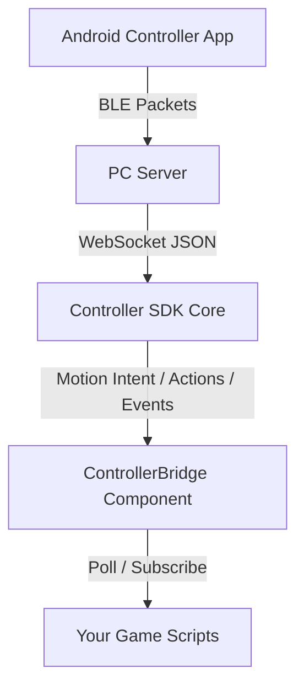

# BlueStep Connect - ControllerClient SDK

A unified, multi-engine plugin and SDK that connects a game client to a mobile-sensor WebSocket relay. It captures real-time accelerometer and step-counter data from a mobile device and converts them into gameplay-ready movement and steering inputs (**MotionIntent**).



## Key parts

- [`Controller`](#controller): The core SDK class that manages the WebSocket connection lifecycle, parses messages, and dispatches callbacks.
- [`ControllerBridge`](#controllerbridge): An engine-specific wrapper component (Unity, Godot, Cocos Creator) that automatically manages connection state and synchronizes settings.
- [`MotionSettings`](#motionsettings): A configuration class holding parameters for tilt steering deadzones, step impulses, and damping decay.

## Supported Engines

The SDK provides customized integration bridges for:
*   **Unity**: C# MonoBehaviour wrapper for standard GameObject setups.
*   **Godot 4 (.NET)**: C# `Node` wrapper using Godot signals.
*   **Cocos Creator 3.x**: TypeScript component with custom callbacks.

## Installation Guides

### 1. Unity Installation
1. Copy the `ControllerClient.dll` and its dependency DLLs (like `Newtonsoft.Json.dll`) into your Unity project's `Assets/Plugins/` directory.
2. Copy [ControllerBridge.cs](./engines/unity/ControllerBridge.cs) into your `Assets/Scripts/` directory.
3. Attach the `ControllerBridge` component to a persistent GameObject in your scene.

### 2. Godot 4 (.NET) Installation
1. Copy the [addons/controller_client/](./engines/godot/addons/controller_client) folder containing `plugin.cfg` and [ControllerBridge.cs](./engines/godot/addons/controller_client/ControllerBridge.cs) into your Godot project's `addons/` directory.
2. Copy the `ControllerClient.dll` and its dependency DLLs (like `Newtonsoft.Json.dll`) into your Godot project folder.
3. Add a reference to the `ControllerClient.dll` or project in your `.csproj` file:
   ```xml
   <ItemGroup>
     <Reference Include="ControllerClient">
       <HintPath>path/to/ControllerClient.dll</HintPath>
     </Reference>
   </ItemGroup>
   ```
4. Rebuild your Godot C# solution (`dotnet build` or click the **Build** button in the Godot Editor).
5. Add the `ControllerBridge` node to your active scene tree.

### 3. Cocos Creator 3.x Installation
1. Copy the entire [cocos-creator/controller-client/](./engines/cocos-creator/controller-client) directory into your Cocos Creator project's `assets/` folder.
2. Cocos Creator will compile the TypeScript scripts automatically.
3. Add the `ControllerBridge` component to an active Node in your hierarchy.

## Usage Patterns: Bridge Component vs. Direct Class

You can integrate the SDK into your project using one of two patterns:

### Option A: Using the `ControllerBridge` Component (Recommended)
This approach leverages engine-specific components/nodes. The bridge manages connection lifecycles, setting synchronization, and event-routing automatically. Your scripts simply reference the bridge.

### Option B: Using the `Controller` Class Directly (Advanced)
For custom application architectures, you can bypass the engine bridge entirely. Instantiate the core `Controller` class, configure settings manually, subscribe directly to C#/TS callbacks, and call `Dispatch()` every frame in your update loop.
> Note: 
> Details, class API documentation, and code examples for using the core classes directly can be found in the **[Core SDK Classes Reference](#core-sdk-classes-reference-direct-class-usage)** section at the end of this document.

### Engine Integration Quick-Start Examples (Bridge Component)

The following examples demonstrate how to script gameplay behaviors using the recommended **`ControllerBridge`** component.

#### 1. Unity Example
```csharp
using UnityEngine;
using ControllerClient;

public class PlayerController : MonoBehaviour
{
    private ControllerBridge bridge;
    private Rigidbody rb;
    public float moveSpeed = 6f;
    public float turnSpeed = 120f;

    void Start()
    {
        bridge = ControllerBridge.Instance;
        rb = GetComponent<Rigidbody>();
    }

    void Update()
    {
        if (bridge.IsActionPressed("jump"))
        {
            Jump();
        }
    }

    void FixedUpdate()
    {
        MotionIntent intent = bridge.LastMotion;
        if (intent.Move > 0.01f || Mathf.Abs(intent.Turn) > 0.01f)
        {
            rb.MoveRotation(rb.rotation * Quaternion.Euler(0, intent.Turn * turnSpeed * Time.fixedDeltaTime, 0));
            rb.MovePosition(rb.position + transform.forward * intent.Move * moveSpeed * Time.fixedDeltaTime);
        }
    }

    void Jump() => rb.AddForce(Vector3.up * 5f, ForceMode.Impulse);
}
```

#### 2. Godot 4 (.NET) Example
```csharp
using Godot;
using System;
using ControllerClient;

public partial class Player : CharacterBody3D
{
    private ControllerBridge _bridge;
    public float MoveSpeed = 6.0f;

    public override void _Ready()
    {
        _bridge = GetNode<ControllerBridge>("../ControllerBridge");
    }

    public override void _PhysicsProcess(double delta)
    {
        float move = _bridge.LastMotion.Move;
        float turn = _bridge.LastMotion.Turn;
        
        Vector3 velocity = Velocity;
        Vector3 forwardDirection = -GlobalTransform.Basis.Z;
        velocity = forwardDirection * move * MoveSpeed;
        Velocity = velocity;
        
        RotateY(-turn * _bridge.TurnSpeedDeg * (float)delta * (MathF.PI / 180f));
        MoveAndSlide();
    }
}
```

#### 3. Cocos Creator 3.x Example
```ts
import { _decorator, Component, Vec3 } from 'cc';
import { ControllerBridge } from './controller-client/ControllerBridge';

const { ccclass } = _decorator;

@ccclass('Player')
export class Player extends Component {
    private bridge!: ControllerBridge;
    public moveSpeed: number = 6;

    onLoad() {
        this.bridge = this.node.scene.getComponentInChildren(ControllerBridge)!;
    }

    update(dt: number) {
        const move = this.bridge.lastMotion.move;
        const turn = this.bridge.lastMotion.turn;

        // Apply turning
        this.node.rotate(Vec3.UP, -turn * this.bridge.turnSpeedDeg * dt);

        // Apply forward movement
        const forward = new Vec3();
        this.node.getForward(forward);
        const position = this.node.getPosition();
        position.addScaledVector(forward, move * this.moveSpeed * dt);
        this.node.setPosition(position);
    }
}
```

## Callbacks & Events Reference

The SDK and bridge components expose several callbacks/events to react to real-time events.

### Detailed Callback Reference & Examples

#### 1. Motion Updated
*   **Trigger Condition**: Fired every frame when raw sensor motion data is received and filtered. If the mobile client drops connection or halts updates for more than $250\text{ ms}$, the SDK automatically dispatches a zeroed-out motion intent packet (`default(MotionIntent)`) to stop any character movement.
*   **Parameters**:
    *   **Unity (C# Event/UnityEvent)**: `MotionIntent` struct containing:
        *   `Move` (`float`): Forward movement velocity ($0.0 \dots 1.0$).
        *   `Turn` (`float`): Steering angle ($-1.0 \dots 1.0$).
        *   `Timestamp` (`long`): Unix timestamp in milliseconds.
        *   `rawSteps` (`int`): Cumulative step count.
        *   `StepsCadence` (`float`): Cadence rate of steps.
    *   **Godot (Signal)**: `(float move, float turn, long timestamp, int rawSteps, float stepsCadence)`
    *   **Cocos Creator (TS Callback)**: `MotionIntent` interface (using camelCase: `move`, `turn`, `timestamp`, `rawSteps`, `stepsCadence`).
*   **Code Examples**:
##### Unity C#

```csharp
void Awake() {
    bridge.OnMotionUpdated += (intent) => {
        Debug.Log($"Motion: Move={intent.Move}, Turn={intent.Turn}");
    };
}
```

##### Godot C#

```csharp
public override void _Ready() {
    bridge.MotionUpdated += (move, turn, timestamp, rawSteps, cadence) => {
        GD.Print($"Motion: Move={move}, Turn={turn}");
    };
}
```

##### Cocos Creator TS

```ts
onLoad() {
    bridge.onMotionUpdated = (intent) => {
        console.log(`Motion: move=${intent.move}, turn=${intent.turn}`);
    };
}
```

#### 2. Command Received
*   **Trigger Condition**: Fired when a discrete system command or button event is received from the server (excluding system connection messages, which are routed to Connection State Changed). This is commonly used for UI actions, pausing, menu navigation, or custom trigger buttons in the controller layout (e.g. `"pause"`, `"resume"`, `"screenshot"`).
*   **Parameters**:
    *   `command` (`string`): The command string value matching the system command on the server.
*   **Code Examples**:
##### Unity C#

```csharp
void Start() {
    bridge.OnCommandReceived += (cmd) => {
        if (cmd == "pause") ShowPauseMenu();
        else if (cmd == "resume") HidePauseMenu();
    };
}
```

##### Godot C#

```csharp
public override void _Ready() {
    bridge.CommandReceived += (cmd) => {
        if (cmd == "pause") GetTree().Paused = true;
    };
}
```

##### Cocos Creator TS

```ts
onLoad() {
    bridge.onCommandReceived = (cmd) => {
        if (cmd === 'pause') this.pauseGame();
    };
}
```

#### 3. Connection State Changed
*   **Trigger Condition**: Fired when the WebSocket connection state transitions. It will trigger with `true` when a connection is successfully established, and `false` when the socket is closed, lost, or when the server dispatches a `controller_disconnected` command.
*   **Parameters**:
    *   `connected` (`bool` / `boolean`): True if connected, false otherwise.
*   **Code Examples**:
##### Unity C#

```csharp
void Start() {
    bridge.OnConnectionStateChanged += (connected) => {
        connectionIndicator.SetActive(connected);
        Debug.Log(connected ? "Controller Connected" : "Connection Lost");
    };
}
```

##### Godot C#

```csharp
public override void _Ready() {
    bridge.ConnectionStateChanged += (connected) => {
        GD.Print(connected ? "Online" : "Offline");
    };
}
```

##### Cocos Creator TS

```ts
onLoad() {
    bridge.onConnectionStateChanged = (connected) => {
        this.statusLabel.string = connected ? "Connected" : "Disconnected";
    };
}
```

#### 4. Screenshot Received
*   **Trigger Condition**: Fired asynchronously after requesting a screenshot capture. The PC relay server takes the screenshot, writes it to its local directory, and returns the metadata.
*   **Parameters**:
    *   **Unity (C# Event)**: `ScreenshotResult` object containing:
        *   `FilePath` (`string`): Absolute path to the saved JPEG screenshot on disk.
        *   `Width` (`int`): Width in pixels.
        *   `Height` (`int`): Height in pixels.
    *   **Godot (Signal)**: `(string filePath, int width, int height)`
    *   **Cocos Creator (TS Callback)**: `ScreenshotResult` containing `filePath`, `width`, `height`.
*   **Code Examples**:
##### Unity C#

```csharp
void Start() {
    bridge.OnScreenshotReceived += (result) => {
        byte[] bytes = System.IO.File.ReadAllBytes(result.FilePath);
        Texture2D tex = new Texture2D(result.Width, result.Height);
        tex.LoadImage(bytes);
        previewImage.texture = tex;
    };
}
```

##### Godot C#

```csharp
public override void _Ready() {
    bridge.ScreenshotReceived += (filePath, width, height) => {
        GD.Print($"Godot saved screenshot size: {width}x{height} at {filePath}");
    };
}
```

##### Cocos Creator TS

```ts
onLoad() {
    bridge.onScreenshotReceived = (result) => {
        console.log(`Saved image dimension: ${result.width}x${result.height}`);
    };
}
```

#### 5. GPX Exported
*   **Trigger Condition**: Fired asynchronously when the current GPX trail recording is finalized and written to the server disk as a `.gpx` file.
*   **Parameters**:
    *   **Unity (C# Event)**: `GpxExportResult` object containing:
        *   `FilePath` (`string`): Path to the saved GPX file.
        *   `DistanceKm` (`double`): Total trail distance in kilometers.
        *   `Duration` (`string`): Time duration (`hh:mm:ss`).
        *   `Error` (`string`): Error message if the export failed (empty/null on success).
    *   **Godot (Signal)**: `(string filePath, double distanceKm, string duration, string error)`
    *   **Cocos Creator (TS Callback)**: `GpxExportResult` containing `filePath`, `distanceKm`, `duration`, `error`.
*   **Code Examples**:
##### Unity C#

```csharp
void Start() {
    bridge.OnGpxExported += (result) => {
        if (!string.IsNullOrEmpty(result.Error)) {
            Debug.LogError($"Export failed: {result.Error}");
            return;
        }
        Debug.Log($"Track Saved: {result.FilePath} ({result.DistanceKm} km)");
    };
}
```

##### Godot C#

```csharp
public override void _Ready() {
    bridge.GpxExported += (filePath, distance, duration, error) => {
        if (!string.IsNullOrEmpty(error)) return;
        GD.Print($"GPX saved: {filePath} ({distance} km)");
    };
}
```

##### Cocos Creator TS

```ts
onLoad() {
    bridge.onGpxExported = (result) => {
        if (result.error) {
            console.error(result.error);
            return;
        }
        console.log(`Cocos GPX saved: ${result.filePath}`);
    };
}
```

### Engine-Specific Event Binding Examples

Each engine implements these events according to its design patterns:

#### 1. Unity Event Binding
In Unity, `ControllerBridge` exposes both standard **C# Events** (for code-only binding) and **UnityEvents** (for Inspector-based drag-and-drop binding).

```csharp
using UnityEngine;
using ControllerClient;

public class UnityEventListener : MonoBehaviour
{
    void Start()
    {
        // Bind to C# events
        ControllerBridge.Instance.OnMotionUpdated += OnMotion;
        ControllerBridge.Instance.OnCommandReceived += OnCommand;
        ControllerBridge.Instance.OnConnectionStateChanged += OnConnectionChanged;
        ControllerBridge.Instance.OnScreenshotReceived += OnScreenshot;
        ControllerBridge.Instance.OnGpxExported += OnGpxExported;
    }

    void OnMotion(MotionIntent intent) { /* ... */ }
    void OnCommand(string command) { /* ... */ }
    void OnConnectionChanged(bool connected) { /* ... */ }
    void OnScreenshot(ScreenshotResult result) { /* ... */ }
    void OnGpxExported(GpxExportResult result) { /* ... */ }
}
```

#### 2. Godot 4 (.NET) Signal Binding
In Godot, `ControllerBridge` exposes C# signals that use Godot's event handler patterns.

```csharp
using Godot;

public partial class GodotEventListener : Node
{
    private ControllerBridge _bridge;

    public override void _Ready()
    {
        _bridge = GetNode<ControllerBridge>("ControllerBridge");

        // Bind Godot Signals
        _bridge.MotionUpdated += OnMotion;
        _bridge.CommandReceived += OnCommand;
        _bridge.ConnectionStateChanged += OnConnectionChanged;
        _bridge.ScreenshotReceived += OnScreenshot;
        _bridge.GpxExported += OnGpxExported;
    }

    private void OnMotion(float move, float turn, long timestamp, int rawSteps, float stepsCadence) { /* ... */ }
    private void OnCommand(string command) { /* ... */ }
    private void OnConnectionChanged(bool connected) { /* ... */ }
    private void OnScreenshot(string filePath, int width, int height) { /* ... */ }
    private void OnGpxExported(string filePath, double distanceKm, string duration, string error) { /* ... */ }
}
```

#### 3. Cocos Creator 3.x Callback Binding
In Cocos Creator, callbacks are simple TypeScript properties on `ControllerBridge` that you assign.

```ts
import { _decorator, Component } from 'cc';
import { ControllerBridge } from './controller-client/ControllerBridge';

const { ccclass } = _decorator;

@ccclass('CocosEventListener')
export class CocosEventListener extends Component {
    onLoad() {
        const bridge = this.node.scene.getComponentInChildren(ControllerBridge)!;

        // Assign callbacks
        bridge.onCommandReceived = (command) => this.onCommand(command);
        bridge.onScreenshotReceived = (result) => this.onScreenshot(result);
        bridge.onGpxExported = (result) => this.onGpxExported(result);
        
        // Assign connection callback
        bridge.onConnectionStateChanged = (connected) => this.onConnectionChanged(connected);
    }

    onCommand(command: string) { /* ... */ }
    onScreenshot(result: any) { /* ... */ }
    onGpxExported(result: any) { /* ... */ }
    onConnectionChanged(connected: boolean) { /* ... */ }
}
```

## Motion Math & Processing

The core SDK contains a [MotionProcessor](./ControllerClient/MotionProcessor.cs) that continuously filters raw sensor readings:

### Steering Calculation
Steering is derived from the lateral component of the mobile device's normalized accelerometer gravity vector:

$$\text{Raw Steering} = \frac{A_x}{\sqrt{A_x^2 + A_y^2 + A_z^2}}$$

1. **Deadzone Filtering**: If the absolute raw steering is below the configured `DeadZone`, steering is ignored to prevent idle drift.
2. **Clamping & Normalization**:
   $$\text{Target Steering} = \text{Clamp}\left(\frac{\text{Raw Steering} - \text{DeadZone}}{(1.0 - \text{DeadZone}) \times \text{MaxTilt}}, -1.0, 1.0\right)$$
3. **Smoothing**: A linear interpolation (lerp) is applied each frame to smooth out sudden changes:
   $$\text{Smoothed Steering} = \text{Lerp}(\text{Current}, \text{Target}, \text{SteeringSmoothing})$$

### Movement Calculation
Forward velocity is driven by physical steps:
1. **Step Impulse**: When a new step is detected (the cumulative steps value incrementing), a fixed impulse `StepImpulse` is added to the velocity:
   $$V_{\text{new}} = V_{\text{old}} + (\Delta \text{Steps} \times \text{StepImpulse})$$
2. **Speed Ceil**: Velocity is capped to a maximum value `MaxMove`.
3. **Damping Decay**: During frames without steps, the forward velocity decays exponentially based on `MoveDamping` and the frame delta time $dt$:
   $$V_{\text{decayed}} = V_{\text{new}} \times e^{-\text{MoveDamping} \times dt}$$

## Configuration Parameters

The following parameters are exposed in the inspectors of `ControllerBridge` in all three engines. They sync dynamically to the core settings at runtime every frame.

### Detailed Parameter Reference

1.  **`Url` / `url`**
    *   **Default**: `ws://localhost:8765/sensor`
    *   **Constraints**: Valid WebSocket URI scheme (`ws://` or `wss://`).
    *   **Description**: The target address of the mobile sensor relay server. The SDK connects to this server and triggers automatic reconnect loops every 2 seconds if the connection is dropped.

2.  **`MaxTilt` / `maxTilt`**
    *   **Default**: `0.6`
    *   **Range**: `0.1` to `1.0`
    *   **Description**: Normalization threshold representing the physical device tilt angle that maps to maximum steering ($\pm 1.0$). Any physical tilt exceeding this threshold is clamped to $\pm 1.0$. Lower values make steering highly sensitive, requiring less physical tilt.

3.  **`DeadZone` / `deadZone`**
    *   **Default**: `0.05`
    *   **Range**: `0.0` to `0.5`
    *   **Description**: Minimum threshold below which device tilt/steering is ignored. This eliminates drift from sensor noise or tiny hand movements when the mobile device is resting or held flat.

4.  **`SteeringSmoothing` / `steeringSmoothing`**
    *   **Default**: `0.12`
    *   **Range**: `0.01` to `1.0`
    *   **Description**: Interpolation weight for smoothing steering changes between frames: `current = Lerp(current, target, SteeringSmoothing)`. A value of `1.0` snaps instantly to the target; lower values smooth out jitter but introduce sub-frame responsiveness latency.

5.  **`TurnSpeedDeg` / `turnSpeedDeg`**
    *   **Default**: `120.0`
    *   **Range**: `10.0` to `360.0`
    *   **Description**: The maximum turning speed in degrees per second. This does not affect the raw filter calculations but is exposed as a convenience property in the bridge class to drive engine-specific rotation scripts.

6.  **`StepImpulse` / `stepImpulse`**
    *   **Default**: `0.4`
    *   **Range**: `0.05` to `2.0`
    *   **Description**: The forward velocity increment added to the player's movement speed buffer for each physical step detected by the mobile device.

7.  **`MaxMove` / `maxMove`**
    *   **Default**: `1.5`
    *   **Range**: `0.5` to `5.0`
    *   **Description**: The speed ceiling for forward movement. Forward velocity accumulated through steps cannot exceed this limit.

8.  **`MoveDamping` / `moveDamping`**
    *   **Default**: `2.0`
    *   **Range**: `0.1` to `10.0`
    *   **Description**: Rate of exponential decay applied to the forward velocity speed buffer each frame. Higher values cause the player to stop quickly when they halt, while lower values cause the player to glide or drift forward.

### Parameters Configuration Examples

#### 1. Inspector Configuration
All eight parameters are decorated with standard engine attributes (`[Range]` in Unity, `@property` in Cocos Creator, and `[Export(PropertyHint.Range)]` in Godot). They are fully editable inside the engine inspector panel during both edit mode and live play mode.

#### 2. C# Dynamic Runtime Tuning (Unity & Godot)
You can edit parameters programmatically during gameplay (e.g. for speed power-ups, ice friction, or difficulty settings). Changes sync to the underlying settings object automatically on the next frame:

```csharp
using UnityEngine;

public class GameplayModulator : MonoBehaviour
{
    private ControllerBridge bridge;

    void Start()
    {
        bridge = ControllerBridge.Instance;
    }

    // Call to activate speed-run state
    public void EnableSuperSpeedMode()
    {
        bridge.MaxMove = 4.0f;        // Raise the speed cap
        bridge.StepImpulse = 0.9f;    // More speed per step
        bridge.MoveDamping = 1.0f;    // Half the deceleration rate
    }

    // Call to reset parameters back to normal
    public void ResetTuningParameters()
    {
        bridge.MaxMove = 1.5f;
        bridge.StepImpulse = 0.4f;
        bridge.MoveDamping = 2.0f;
    }
}
```

#### 3. TypeScript Dynamic Runtime Tuning (Cocos Creator)
```ts
import { _decorator, Component } from 'cc';
import { ControllerBridge } from './controller-client/ControllerBridge';

const { ccclass } = _decorator;

@ccclass('EnvironmentModulator')
export class EnvironmentModulator extends Component {
    private bridge!: ControllerBridge;

    onLoad() {
        this.bridge = this.node.scene.getComponentInChildren(ControllerBridge)!;
    }

    // Adjust parameters for slippery ice physics
    applyIcePhysics() {
        this.bridge.moveDamping = 0.25;         // Barely slow down automatically
        this.bridge.steeringSmoothing = 0.02;   // Slow, slippery steering response
    }
}
```

## API Reference

The following APIs are exposed on the `ControllerBridge` component for standard gameplay integration. If you are using the core classes directly instead, refer to the **[Core SDK Classes Reference](#core-sdk-classes-reference-direct-class-usage)** at the end of this document.

### 2. Action States (Button Polling)
The SDK maintains a boolean dictionary of button/action states. A button is set to `true` when pressed, and automatically released if no updates are received after a short timeout ($150\text{ ms}$). The `actionName` is mapped to the command column under edit button in the layout configuration in the server. 

#### API Methods
*   **C#**: `bool IsActionPressed(string actionName)`
*   **TypeScript**: `isActionPressed(actionName: string): boolean`

#### Example Usage
##### C# (Unity & Godot)

```csharp
void Update() {
if (bridge.IsActionPressed("jump")) {
    TriggerJump();
}
if (bridge.IsActionPressed("fire")) {
    TriggerShoot();
}
}
```

##### TypeScript (Cocos Creator)

```ts
update(dt: number) {
const bridge = this.node.getComponent(ControllerBridge)!;
if (bridge.isActionPressed("jump")) {
    this.triggerJump();
}
}
```

### 3. Screenshot Capture API
Requests the PC relay server to take a screenshot. Screenshots are processed asynchronously on the server and written to its local disk.

#### Methods
*   `CaptureScreen()`: Captures the entire monitor view (including taskbars and background apps).
*   `CaptureScreen(bool windowMode)` / `captureScreen(windowMode: boolean)`: Captures only the foreground/active window.
*   `CaptureScreen(string windowTitle)` / `captureScreen(windowTitle: string)`: Searches for a window title matching this string (case-insensitive partial match) and captures it.

#### Data Models

##### ScreenshotResult (C#)
| Prop | Type | Description |
|------|------|------|
| `FilePath` | `string` | Absolute path to the saved JPEG image file on the server. |
| `Width` | `int` | Width of the captured screenshot in pixels. |
| `Height` | `int` | Height of the captured screenshot in pixels. |

##### ScreenshotResult (TypeScript)
| Prop | Type | Description |
|------|------|------|
| `filePath` | `string` | Absolute path to the saved JPEG image file on the server. |
| `width` | `number` | Width of the captured screenshot in pixels. |
| `height` | `number` | Height of the captured screenshot in pixels. |

#### Code Examples
##### Unity

```csharp
void Start() {
    ControllerBridge.Instance.OnScreenshotReceived += OnScreenshot;
}

void Capture() {
    ControllerBridge.Instance.CaptureScreen("My Unity Game");
}

void OnScreenshot(ScreenshotResult result) {
    Debug.Log($"Saved: {result.FilePath} ({result.Width}x{result.Height})");
}
```

##### Godot 4 (.NET)

```csharp
public override void _Ready() {
    var bridge = GetNode<ControllerBridge>("ControllerBridge");
    bridge.ScreenshotReceived += OnScreenshot;
    bridge.CaptureScreen(windowMode: true);
}

private void OnScreenshot(string filePath, int width, int height) {
    GD.Print($"Saved: {filePath} ({width}x{height})");
}
```

##### Cocos Creator

```ts
onLoad() {
    const bridge = this.node.getComponent(ControllerBridge)!;
    bridge.onScreenshotReceived = (res) => {
        console.log(`Saved: ${res.filePath} (${res.width}x${res.height})`);
    };
    bridge.captureScreen();
}
```

### 4. Vibration API
Triggers haptic feedback vibration on the connected mobile device.

#### Methods
*   `Vibrate(int durationMs = 200)` / `vibrate(durationMs: number = 200)`: Requests a vibration pattern.

#### Code Examples
##### C# (Unity & Godot)

```csharp
// Vibrate with default duration (200ms)
bridge.Vibrate();

// Vibrate for a longer duration (500ms)
bridge.Vibrate(500);
```

##### TypeScript (Cocos Creator)

```ts
// Trigger standard haptic vibration
bridge.vibrate(150);
```

### 5. GPX Recording & Exporting API
The GPX API captures spatial paths during play sessions and exports them as `.gpx` files (compatible with Strava, Garmin, etc.).

#### Two Recording Modes
1.  **Simulated Mode (Default)**: The server automatically creates a route starting at the specified coordinates, advancing the location vector forward based on step count cadence.
2.  **Manual Mode**: The game script dynamically pushes the player's 3D position to the server, which converts the coordinate delta offsets into geographic latitude/longitude.

> Note: 
> When using **Manual Mode**, you **must** supply origin latitude and longitude coordinates during `StartGpx`. Otherwise, the server defaults to user defined starting point in the server. It will be different for every different user. If your game world coordinates do not match, the exported GPX trail will have a teleportation spike from the default origin to the actual game coordinate offsets.

#### API Methods
*   `StartGpx()` / `startGpx()`: Starts Simulated GPX recording using the server's default origin.
*   `StartGpx(bool manualLocation)` / `startGpx(manualLocation: boolean)`: Starts GPX recording using the server's default origin. If `manualLocation` is `true`, positions must be updated manually.
*   `StartGpx(double lat, double lon)` / `startGpx(lat: number, lon: number)`: Starts Simulated GPX recording using a custom geographic origin.
*   `StartGpx(double lat, double lon, bool manualLocation)` / `startGpx(lat: number, lon: number, manualLocation: boolean)`: Starts GPX recording using a custom geographic origin.
*   `UpdateGpxLocation(double lat, double lon)` / `updateGpxLocation(lat: number, lon: number)`: Sends the player's current geographic coordinate. This method is automatically throttled client-side to $\sim 2\text{ Hz}$ ($500\text{ ms}$). Calls made faster than this limit are ignored.
*   `ExportGpx()` / `exportGpx()`: Finalizes the session and exports the GPX trail to the PC server's local storage.

#### Data Models

##### GpxExportResult (C#)
| Prop | Type | Description |
|------|------|------|
| `FilePath` | `string` | Path on the server disk where the `.gpx` trail was exported. |
| `DistanceKm` | `double` | Cumulative path distance calculated in kilometers. |
| `Duration` | `string` | Total recording duration formatted as `hh:mm:ss`. |
| `Error` | `string` | Non-empty error message string if export failed on the server. |

##### GpxExportResult (TypeScript)
| Prop | Type | Description |
|------|------|------|
| `filePath` | `string` | Path on the server disk where the `.gpx` trail was exported. |
| `distanceKm` | `number` | Cumulative path distance calculated in kilometers. |
| `duration` | `string` | Total recording duration formatted as `hh:mm:ss`. |
| `error` | `string` (Optional) | Error message string if export failed. |

#### Complete Game Integration & Coordinate Conversions
To record geographic coordinates, you must translate the game engine's local 3D Cartesian coordinates ($X, Y, Z$) to spherical geographic coordinates ($\text{Latitude}, \text{Longitude}$).

Using the standard flat-Earth projection approximation (accurate for small localized maps):
$$\text{Latitude} = \text{OriginLat} + \frac{Z}{\text{MetersPerDegreeLatitude}}$$
$$\text{Longitude} = \text{OriginLon} + \frac{X}{\text{MetersPerDegreeLongitude}}$$

Where:
*   $\text{MetersPerDegreeLatitude} \approx 111,320\text{ meters}$
*   $\text{MetersPerDegreeLongitude} = \text{MetersPerDegreeLatitude} \times \cos(\text{OriginLat} \times \frac{\pi}{180})$

##### Unity Integration Example
```csharp
using UnityEngine;
using ControllerClient;

public class UnityGpxTracker : MonoBehaviour
{
    private ControllerBridge bridge;
    private const double OriginLat = 3.2206334;
    private const double OriginLon = 101.9676587;
    private float lastGpsUpdate;

    void Start()
    {
        bridge = ControllerBridge.Instance;
        bridge.OnGpxExported += OnGpxExported;

        // Start GPX in manual mode
        bridge.StartGpx(OriginLat, OriginLon, manualLocation: true);
    }

    void Update()
    {
        // Update location at intervals (client is throttled at 500ms, but we can poll at 500ms)
        if (Time.time - lastGpsUpdate >= 0.5f)
        {
            var (lat, lon) = ConvertUnityToGps(transform.position);
            bridge.UpdateGpxLocation(lat, lon);
            lastGpsUpdate = Time.time;
        }

        // Trigger export on key press
        if (Input.GetKeyDown(KeyCode.E))
        {
            bridge.ExportGpx();
        }
    }

    private (double lat, double lon) ConvertUnityToGps(Vector3 pos)
    {
        const double metersPerDegreeLat = 111320.0;
        double lat = OriginLat + (pos.z / metersPerDegreeLat);
        double metersPerDegreeLon = metersPerDegreeLat * Mathf.Cos((float)(OriginLat * Mathf.Deg2Rad));
        double lon = OriginLon + (pos.x / metersPerDegreeLon);
        return (lat, lon);
    }

    private void OnGpxExported(GpxExportResult result)
    {
        if (!string.IsNullOrEmpty(result.Error))
        {
            Debug.LogError($"Export failed: {result.Error}");
            return;
        }
        Debug.Log($"GPX Exported to: {result.FilePath} | Distance: {result.DistanceKm}km | Duration: {result.Duration}");
    }
}
```

##### Godot 4 (.NET) Integration Example
```csharp
using Godot;
using System;

public partial class GodotGpxTracker : Node3D
{
    private ControllerBridge _bridge;
    private const double OriginLat = 3.2206334;
    private const double OriginLon = 101.9676587;
    private double _timeAccumulator;

    public override void _Ready()
    {
        _bridge = GetNode<ControllerBridge>("ControllerBridge");
        _bridge.GpxExported += OnGpxExported;

        _bridge.StartGpx(OriginLat, OriginLon, manualLocation: true);
    }

    public override void _PhysicsProcess(double delta)
    {
        _timeAccumulator += delta;
        if (_timeAccumulator >= 0.5)
        {
            _timeAccumulator = 0.0;
            var (lat, lon) = ConvertGodotToGps(GlobalPosition);
            _bridge.UpdateGpxLocation(lat, lon);
        }
    }

    private (double lat, double lon) ConvertGodotToGps(Vector3 pos)
    {
        const double metersPerDegreeLat = 111320.0;
        double lat = OriginLat + (pos.Z / metersPerDegreeLat);
        double metersPerDegreeLon = metersPerDegreeLat * Math.Cos(OriginLat * Math.PI / 180.0);
        double lon = OriginLon + (pos.X / metersPerDegreeLon);
        return (lat, lon);
    }

    private void OnGpxExported(string filePath, double distanceKm, string duration, string error)
    {
        if (!string.IsNullOrEmpty(error))
        {
            GD.PrintErr($"Export failed: {error}");
            return;
        }
        GD.Print($"GPX Exported to: {filePath} ({distanceKm} km, {duration})");
    }
}
```

##### Cocos Creator Integration Example
```ts
import { _decorator, Component, Vec3, KeyCode, input, Input } from 'cc';
import { ControllerBridge } from './controller-client/ControllerBridge';

const { ccclass } = _decorator;

@ccclass('CocosGpxTracker')
export class CocosGpxTracker extends Component {
    private bridge!: ControllerBridge;
    private readonly originLat = 3.2206334;
    private readonly originLon = 101.9676587;
    private timeAccumulator = 0;

    onLoad() {
        this.bridge = this.node.scene.getComponentInChildren(ControllerBridge)!;
        this.bridge.onGpxExported = (res) => {
            if (res.error) {
                console.error(`Export failed: ${res.error}`);
                return;
            }
            console.log(`GPX Exported: ${res.filePath} (${res.distanceKm} km, ${res.duration})`);
        };

        this.bridge.startGpx(this.originLat, this.originLon, true);
    }

    update(dt: number) {
        this.timeAccumulator += dt;
        if (this.timeAccumulator >= 0.5) {
            this.timeAccumulator = 0;
            const gps = this.convertCocosToGps(this.node.worldPosition);
            this.bridge.updateGpxLocation(gps.lat, gps.lon);
        }
    }

    private convertCocosToGps(worldPos: Vec3) {
        const metersPerDegreeLat = 111320.0;
        // In Cocos, Z maps to latitude (North/South) and X to longitude (East/West)
        const lat = this.originLat + (worldPos.z / metersPerDegreeLat);
        const metersPerDegreeLon = metersPerDegreeLat * Math.cos(this.originLat * Math.PI / 180.0);
        const lon = this.originLon + (worldPos.x / metersPerDegreeLon);
        return { lat, lon };
    }
}
```

## WebSocket Protocol Details

The core client SDK establishes a standard WebSocket communication channel. You can inspect or build your own client/server implementation using the following JSON packet specifications:

### 1. Server-bound Packets (Game $\to$ Server)

#### captureScreen
Triggered by screenshot APIs.
```json
{
  "packetType": "captureScreen",
  "timeStamp": 1700000000000,
  "payload": {
    "mode": "window", 
    "title": "My Mini Game" // Optional. If omitted, captures foreground active window
  }
}
```

#### vibrate
Triggered by vibration API calls.
```json
{
  "packetType": "vibrate",
  "timeStamp": 1700000000000,
  "payload": {
    "duration": 300
  }
}
```

#### gpxStart
Triggered by starting a GPX trail recording.
```json
{
  "packetType": "gpxStart",
  "timeStamp": 1700000000000,
  "payload": {
    "lat": 3.2206334,         // Optional geographic start latitude
    "lon": 101.9676587,       // Optional geographic start longitude
    "manualLocation": true    // True to supply positions manually, false to simulate
  }
}
```

#### gpxUpdateLocation
Triggered when sending manual coordinate updates.
```json
{
  "packetType": "gpxUpdateLocation",
  "timeStamp": 1700000000500,
  "payload": {
    "lat": 3.2206370,
    "lon": 101.9676610
  }
}
```

#### gpxExport
Triggered when requesting a GPX trail export.
```json
{
  "packetType": "gpxExport",
  "timeStamp": 1700000025000,
  "payload": {}
}
```

### 2. Client-bound Packets (Server $\to$ Game)

All messages coming from the server have a `type` field that discriminates their payload schema.

#### movement
Pushed at 60Hz. Delivers raw accelerometer, steps, and active buttons snapshot.
```json
{
  "type": "movement",
  "timestamp": 1700000000100,
  "x": 0.12,
  "y": 9.81,
  "z": -0.45,
  "steps": 154,
  "stepsCadence": 1.75,
  "buttons": {
    "jump": true,
    "fire": false,
    "crouch": false
  }
}
```

#### command
Delivers system-level notifications or explicit commands.
```json
{
  "type": "command",
  "timestamp": 1700000000120,
  "value": "pause" // e.g. "pause", "resume", "controller_connected", "controller_disconnected"
}
```

#### screenshot
Fired when a screenshot is successfully processed and saved.
```json
{
  "type": "screenshot",
  "timestamp": 1700000004500,
  "path": "C:\\Screenshots\\screenshot_1700000000.jpg",
  "width": 1920,
  "height": 1080
}
```

#### gpxStarted
Fired confirming a GPX session has successfully initialized.
```json
{
  "type": "gpxStarted",
  "timestamp": 1700000000110,
  "mode": "manual", // "manual" or "simulated"
  "error": ""       // Non-empty if initialization failed
}
```

#### gpxExported
Fired with result statistics when a GPX recording is exported.
```json
{
  "type": "gpxExported",
  "timestamp": 1700000025500,
  "path": "C:\\GPX\\trail_1700000025.gpx",
  "distance": 0.84,
  "duration": "00:00:25",
  "error": "" // Non-empty if export failed
}
```

## Troubleshooting Guide

| Issue | Cause | Solution |
|------|------|------|
| **No motion data received** | The WebSocket client is disconnected. | Verify that the relay server is running and checking that your network firewall allows connections on the targeted port. Check the console logs for connection exceptions. |
| **Steering drifts when device is held flat** | Accelerometer readings are inside the steering threshold. | Increase the `DeadZone` parameter to filter out noise when the mobile device is resting or in a neutral posture. |
| **Steering is sluggish or over-sensitive** | `SteeringSmoothing` or `MaxTilt` are misconfigured. | Lower the `SteeringSmoothing` factor for faster snap-turns, or increase `MaxTilt` to require more extreme physical rotation angles before achieving maximum turning speed. |
| **GPX trail starts with a massive teleportation vector** | `StartGpx` coordinates did not match the game's actual local start location. | Make sure to call `StartGpx` in manual mode passing the correct geographical latitude/longitude of your starting arena origin. |
| **Screenshot result is completely blank** | Capture targeted the wrong graphics buffer or window context. | Specify the window title directly via `CaptureScreen("My Game Window Name")` to ensure the correct native handle is targeted by the server capture worker. |

## Core SDK Classes Reference (Direct Class Usage)

For custom application architectures that bypass the pre-built `ControllerBridge` component, you can instantiate and manage the core SDK classes directly. This section documents all the engine-agnostic core classes.

### 1. `Controller` Class

The primary class that manages the WebSocket connection lifecycle, message parsing, and event dispatching.

#### Public API (C#)
*   **Constructor**: `Controller(MotionSettings settings = null)`
*   **Properties**:
    *   `Actions` (`ActionState`): The current state of action buttons.
    *   `IsConnected` (`bool`, Read-Only): Returns true if the WebSocket connection is open.
*   **Methods**:
    *   `Connect(string url = "ws://localhost:8765/sensor")`: Starts the asynchronous connection loop.
    *   `Dispatch()`: Dequeues and executes events on the calling thread. **Must be called every frame in your update loop.**
    *   `Dispose()`: Closes the WebSocket connection and cleans up resources.
    *   `CaptureScreen()`, `CaptureScreen(bool windowMode)`, `CaptureScreen(string windowTitle)`: Request screenshots.
    *   `Vibrate(int durationMs = 200)`: Triggers controller vibration.
    *   `StartGpx()`, `StartGpx(bool manualLocation)`, `StartGpx(double lat, double lon)`, `StartGpx(double lat, double lon, bool manualLocation)`: GPX lifecycle methods.
    *   `UpdateGpxLocation(double lat, double lon)`: Manual location updates (internally throttled to 500ms).
    *   `ExportGpx()`: Request trail export.
*   **Events**:
    *   `event Action<MotionIntent> OnMotion`
    *   `event Action<string> OnCommand`
    *   `event Action<bool> OnConnectionStateChanged`
    *   `event Action<ScreenshotResult> OnScreenshot`
    *   `event Action<GpxExportResult> OnGpxExported`

#### Public API (TypeScript)
*   **Constructor**: `constructor(settings?: MotionSettings)`
*   **Properties**:
    *   `actions`: `ActionState`
    *   `connected`: `boolean`
*   **Methods**:
    *   `connect(url: string)`: Opens connection.
    *   `dispatch()`: Dispatches queued events.
    *   `dispose()`: Disposes WebSocket.
    *   `captureScreen(mode?: boolean | string)`: Request screenshots.
    *   `vibrate(durationMs?: number)`: Haptic request.
    *   `startGpx(arg1?: boolean | number, arg2?: number, arg3?: boolean)`: Start GPX session.
    *   `updateGpxLocation(lat: number, lon: number)`: Manual location update.
    *   `exportGpx()`: Request GPX export.
*   **Callbacks**:
    *   `onMotion: ((intent: MotionIntent) => void) | null`
    *   `onCommand: ((command: string) => void) | null`
    *   `onConnectionStateChanged: ((connected: boolean) => void) | null`
    *   `onScreenshot: ((result: ScreenshotResult) => void) | null`
    *   `onGpxExported: ((result: GpxExportResult) => void) | null`

#### Core Lifecycle Code Examples
##### C#

```csharp
using ControllerClient;

public class CoreControllerExample
{
    private Controller controller;

    public void Initialize()
    {
        var settings = new MotionSettings { StepImpulse = 0.5f, MaxMove = 2.0f };
        controller = new Controller(settings);
        controller.OnMotion += (intent) => LogMotion(intent);
        controller.Connect("ws://localhost:8765/sensor");
    }

    public void Update()
    {
        // Vital: Dispatch queued events to the main thread
        controller.Dispatch();
    }

    public void Shutdown()
    {
        controller.Dispose();
    }

    private void LogMotion(MotionIntent intent) { /* ... */ }
}
```

##### TypeScript

```ts
import { Controller, MotionSettings } from './controller-client';

const settings = new MotionSettings();
settings.stepImpulse = 0.5;

const controller = new Controller(settings);
controller.onMotion = (intent) => {
    console.log(`Move: ${intent.move}, Turn: ${intent.turn}`);
};
controller.connect("ws://localhost:8765/sensor");

// Call every frame in render/update loop:
function updateLoop() {
    controller.dispatch();
}

// Call on shutdown:
controller.dispose();
```

### 2. `MotionSettings` Class
Contains parameters that configure raw motion sensor filtering.

#### C# Fields
*   `float MaxTilt` (Default: `0.6f`, Range: `0.1f – 1.0f`)
*   `float DeadZone` (Default: `0.05f`, Range: `0.0f – 0.5f`)
*   `float SteeringSmoothing` (Default: `0.12f`, Range: `0.01f – 1.0f`)
*   `float TurnSpeedDeg` (Default: `120f`, Range: `10f – 360f`)
*   `float StepImpulse` (Default: `0.4f`, Range: `0.05f – 2.0f`)
*   `float MaxMove` (Default: `1.5f`, Range: `0.5f – 5.0f`)
*   `float MoveDamping` (Default: `2.0f`, Range: `0.1f – 10.0f`)

#### TypeScript Fields
Equivalent camelCase properties: `maxTilt`, `deadZone`, `steeringSmoothing`, `turnSpeedDeg`, `stepImpulse`, `maxMove`, `moveDamping`.

### 3. `ActionState` Class
Exposes polling methods to check whether custom actions/buttons are currently pressed.

#### Methods (C#)
*   `bool Get(string action)`: Returns true if the action is currently active.
*   `void Update(Dictionary<string, bool> snapshot, long timestamp)` (Internal): Updates the button states from raw network inputs.
*   `void ReleaseStaleButtons(long currentTimestamp, long timeoutMs = 150)` (Internal): Automatically sets states to `false` if they exceed the timeout threshold.

#### Methods (TypeScript)
*   `get(action: string): boolean`: Checks action status.

### 4. `MotionProcessor` Class (Internal)
Performs frame-by-frame steering gravity computations, linear interpolation smoothing, step delta calculations, speed clamping, and exponential damping decay. Refer to the **[Motion Math & Processing](#motion-math--processing)** section for details on these equations.

### Engine Direct Integration Code Examples (Direct Class Usage)

The following examples demonstrate how to script gameplay behaviors using the raw **`Controller`** class directly (bypassing the bridge components).

#### 1. Unity Example (Direct Class)
```csharp
using UnityEngine;
using ControllerClient;

public class PlayerControllerDirect : MonoBehaviour
{
    private Controller client;
    private MotionIntent currentIntent;
    private Rigidbody rb;
    public float moveSpeed = 6f;
    public float turnSpeed = 120f;

    void Start()
    {
        rb = GetComponent<Rigidbody>();
        var settings = new MotionSettings { StepImpulse = 0.4f, MaxMove = 1.5f, MoveDamping = 2.0f };
        client = new Controller(settings);
        
        client.OnMotion += (intent) => currentIntent = intent;
        client.Connect("ws://localhost:8765/sensor");
    }

    void Update()
    {
        client.Dispatch();
        if (client.Actions.Get("jump"))
        {
            Jump();
        }
    }

    void FixedUpdate()
    {
        if (currentIntent.Move > 0.01f || Mathf.Abs(currentIntent.Turn) > 0.01f)
        {
            rb.MoveRotation(rb.rotation * Quaternion.Euler(0, currentIntent.Turn * turnSpeed * Time.fixedDeltaTime, 0));
            rb.MovePosition(rb.position + transform.forward * currentIntent.Move * moveSpeed * Time.fixedDeltaTime);
        }
    }

    void Jump() => rb.AddForce(Vector3.up * 5f, ForceMode.Impulse);
    void OnDestroy() => client.Dispose();
}
```

#### 2. Godot 4 (.NET) Example (Direct Class)
```csharp
using Godot;
using System;
using ControllerClient;

public partial class PlayerDirect : CharacterBody3D
{
    private Controller _client;
    private MotionIntent _currentIntent;
    public float MoveSpeed = 6.0f;

    public override void _Ready()
    {
        var settings = new MotionSettings { StepImpulse = 0.4f, MaxMove = 1.5f, MoveDamping = 2.0f };
        _client = new Controller(settings);
        
        _client.OnMotion += (intent) => _currentIntent = intent;
        _client.Connect("ws://localhost:8765/sensor");
    }

    public override void _Process(double delta)
    {
        _client.Dispatch();
    }

    public override void _PhysicsProcess(double delta)
    {
        float move = _currentIntent.Move;
        float turn = _currentIntent.Turn;
        
        Vector3 velocity = Velocity;
        Vector3 forwardDirection = -GlobalTransform.Basis.Z;
        velocity = forwardDirection * move * MoveSpeed;
        Velocity = velocity;
        
        RotateY(-turn * 120f * (float)delta * (MathF.PI / 180f));
        MoveAndSlide();
    }

    public override void _ExitTree()
    {
        _client.Dispose();
    }
}
```

#### 3. Cocos Creator 3.x Example (Direct Class)
```ts
import { _decorator, Component, Vec3 } from 'cc';
import { Controller, MotionSettings, MotionIntent } from './controller-client';

const { ccclass } = _decorator;

@ccclass('PlayerDirect')
export class PlayerDirect extends Component {
    private client!: Controller;
    private currentIntent: MotionIntent = { move: 0, turn: 0, timestamp: 0, rawSteps: 0, stepsCadence: 0 };
    public moveSpeed: number = 6;

    onLoad() {
        const settings = new MotionSettings();
        settings.stepImpulse = 0.4;
        settings.maxMove = 1.5;
        settings.moveDamping = 2.0;

        this.client = new Controller(settings);
        this.client.onMotion = (intent) => {
            this.currentIntent = intent;
        };
        this.client.connect('ws://localhost:8765/sensor');
    }

    update(dt: number) {
        this.client.dispatch();

        const move = this.currentIntent.move;
        const turn = this.currentIntent.turn;

        // Apply turning
        this.node.rotate(Vec3.UP, -turn * 120 * dt);

        // Apply forward movement
        const forward = new Vec3();
        this.node.getForward(forward);
        const position = this.node.getPosition();
        position.addScaledVector(forward, move * this.moveSpeed * dt);
        this.node.setPosition(position);
    }

    onDestroy() {
        this.client.dispose();
    }
}
```

